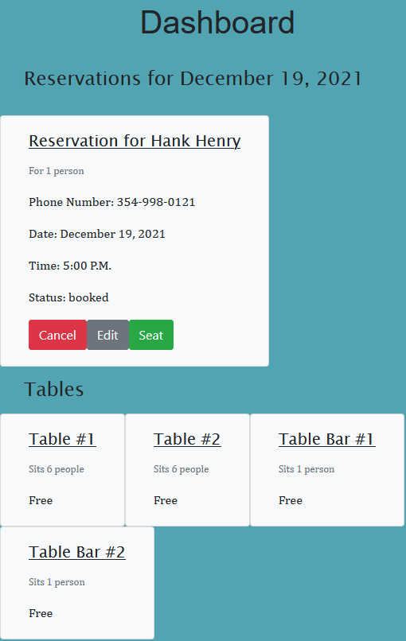
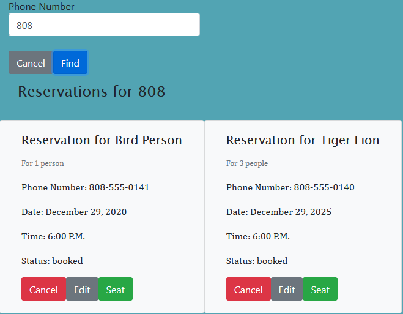
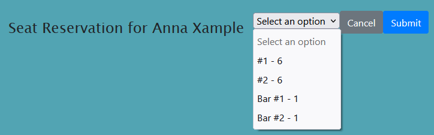
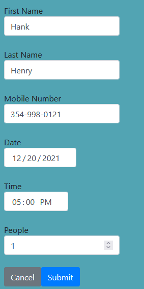

# Restaurant Reservation System

This project manages reservations for a restaurant, including creating, editing, and searching for reservations. It allows for viewing by phone number search or by date. Reservation parties can be seated into tables when they arrived and removed to clear space when they complete their meal.
### Technologies

* Bootstrap 4
* React
* Node
* Express
* PostgreSQL
###  Launch

This project is deployed at https://jma-reservation-client.herokuapp.com/dashboard
To deploy your own version, host the back end and frontend, then adjust the API_BASE_URL variable in the API.js file to refer to the backend url.
### Features

* View reservations for a chosen date  

* Search reservations by phone number (including incomplete phone numbers)  

* Seat reservations at a table to keep track of current table status  

* Cancel or edit reservations  

### API

**GET** `/reservations` Get a list of reservation for a date (today by default)  
**POST** `/reservations` Add a new reservation  

**GET** `/reservations/{reservation_id}` Retrieve data for a specific reservation  
**PUT** `/reservations/{reservation_id}` Update data for a specific reservation  

**PUT** `/reservations/{reservation_id}/status` Update the status of a reservation  

**GET** `/tables` Get a list of all tables  
**POST** `/tables` Add a new table  

**PUT** `/tables/{table_id}/seat` Seats a reservation at a table, updating reservation status as well  
**DELETE** `/tables/{table_id}/seat` Removes a reservation from a table, updating reservation status as well  
